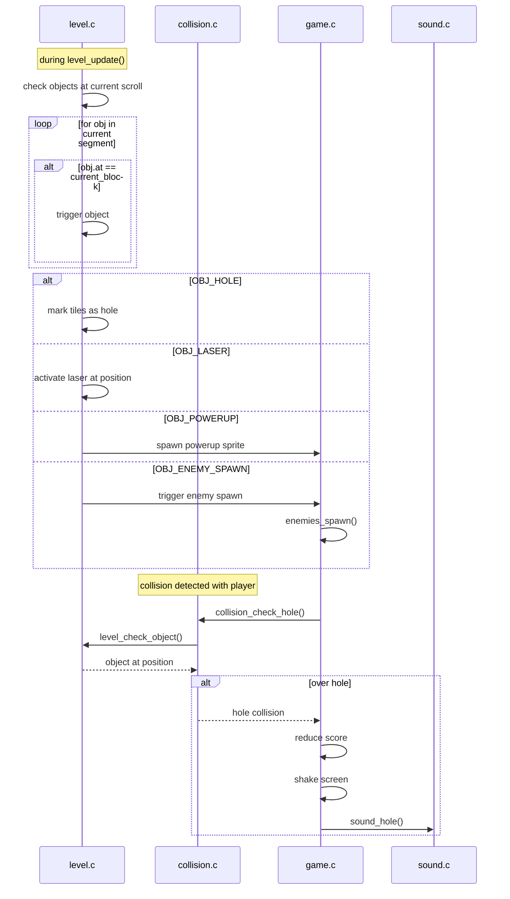

# Level System Sequence Diagrams

## Overview

This document contains sequence diagrams showing the flow of data and control in the dynamic level system.

---

## 1. Build Time: Level Generation

---

## 2. Game Initialization

---

## 3. Game Loop: Frame Update

---

## 4. Segment Transition

---

## 5. Tilemap Row Generation

---

## 6. Collision Check Flow

---

## 7. Object Trigger Flow

---

## 8. Complete Frame Overview

---

## 9. Data Flow Summary

---

## 10. Lane Configuration Visualization

---

## 11. Segment Lifecycle State Machine

---

## 12. Object Processing Pipeline

